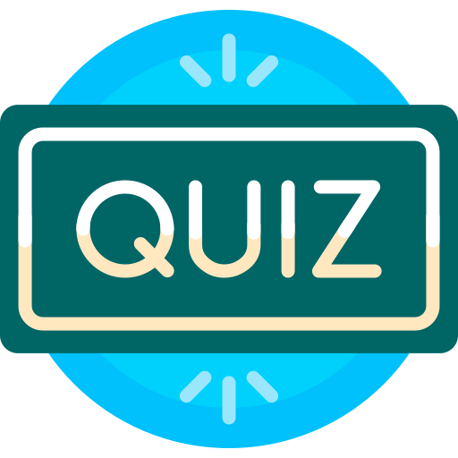
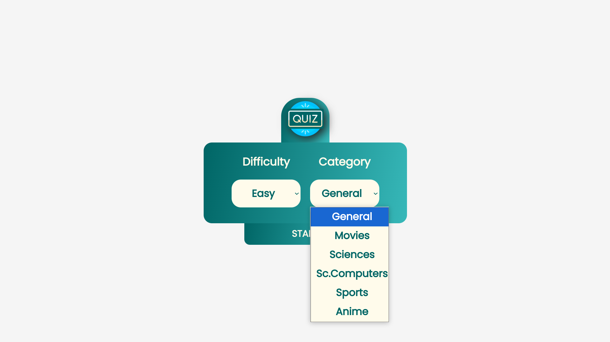
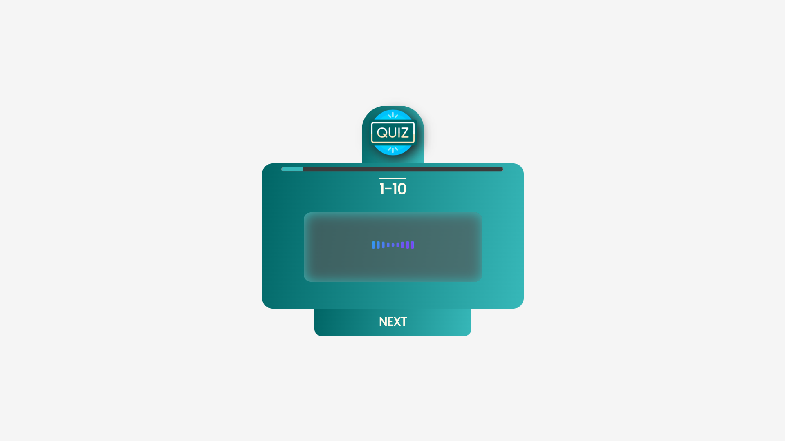
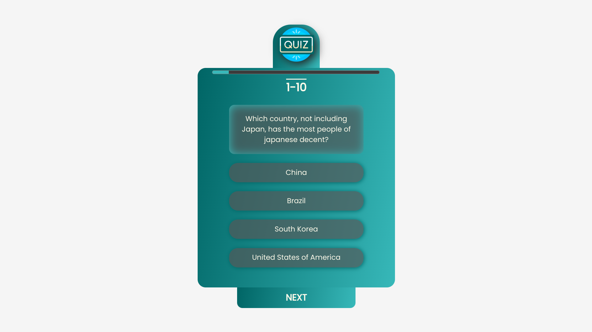
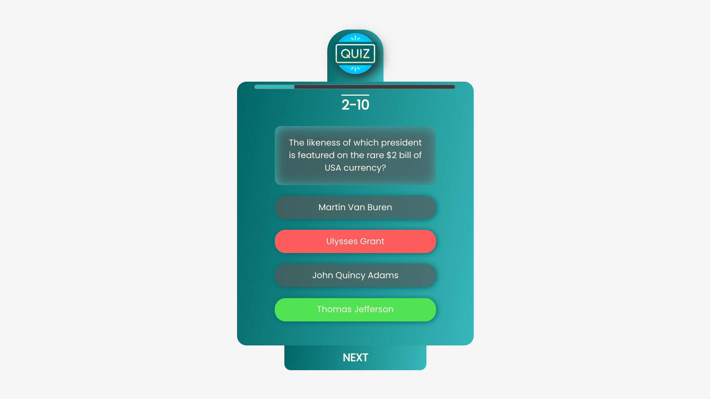
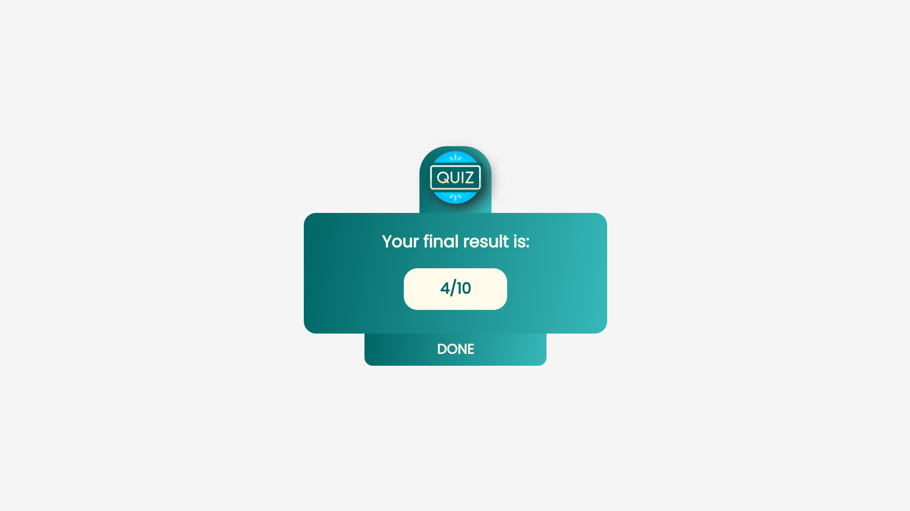

# Quiz Game



## Overview

This Quiz Game is a web application that allows users to test their knowledge across various categories and difficulty levels. The game retrieves questions from the Open Trivia Database API and presents them in a multiple-choice format. Players can select their preferred category and difficulty before starting the quiz.

## Features

- **Difficulty Levels**: Choose between Easy, Medium, and Hard.
- **Categories**: General, Movies, Sciences, Computers, Sports, and Anime.
- **Progress Tracking**: A progress bar and question counter help players keep track of their quiz progress.
- **Scoring**: The game keeps track of the player's score, displaying the final result at the end of the quiz.
- **Audio Feedback**: The game provides audio cues for correct and incorrect answers, as well as for game start, game over, and other events.

## Technologies Used

- **HTML**: For the structure of the application.
- **CSS**: For styling the user interface.
- **JavaScript**: For game logic, event handling, and API interactions.
- **Open Trivia Database API**: For fetching quiz questions.

## Installation

To run this project locally, follow these steps:

1. **Clone the repository**:
   ```bash
   git clone https://github.com/Ilyass-Bezaiz/quiz-game.git
   ```
2. **Navigate to the project directory**:
   ```bash
   cd quiz-game
   ```
3. **Open `index.html` in your web browser**.

## How to Play

1. **Select Difficulty**: Choose the difficulty level (Easy, Medium, Hard).
2. **Select Category**: Choose a category for the questions (e.g., General, Movies).
3. **Start the Game**: Click the "START" button to begin.
4. **Answer Questions**: Click on the correct answer from the four options provided.
5. **Next Question**: After selecting an answer, click "NEXT" to move to the next question.
6. **View Results**: At the end of the quiz, your score will be displayed.

## Screenshots

### Welcome Screen


### Loading Screen


### Question Screen



### Result Screen


## Audio Effects

The game includes the following audio effects:

- **Game Start**: Plays when the quiz starts.
- **Correct Answer**: Plays when the player selects the correct answer.
- **Wrong Answer**: Plays when the player selects the wrong answer.
- **You Win**: Plays if the player scores 5 or more points.
- **Game Over**: Plays if the player scores less than 5 points.
- **Error Message**: Plays when there is an error, such as no internet connection.

## Future Enhancements

- **Additional Categories**: Expand the range of available quiz categories.
- **Timer**: Add a countdown timer for each question.
- **Leaderboard**: Implement a feature to track and display high scores.

## License

This project is open-source and available under the [MIT License](./LICENSE).

## Acknowledgments

- Questions are provided by the [Open Trivia Database API](https://opentdb.com/).
- Audio effects were sourced from [Freesound](https://freesound.org/).
